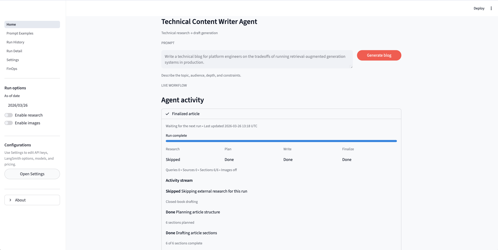

# Technical Content Writer Agent

Technical Content Writer Agent or Deep Blog Agent is a Streamlit + LangGraph application for generating technical blog posts from a short prompt or topic. It can research the topic with Tavily, draft a structured article with OpenAI, optionally generate supporting images, and save each run as a reusable artifact bundle.



Test this app on streamlit by adding your own API Credentials through UI in Settings page: [Click Here](https://surajbhartcwagent.streamlit.app/)

YouTube Video Demonstration Link: [YouTube](https://youtu.be/zuAzi6HcQLk)

## Overview

This project is designed for technical writing workflows where you want a working draft quickly, but still need research support, citations, and a reviewable output structure.

The application provides:

- a Streamlit workspace for prompting, live workflow visibility, history, run detail, settings, and cost review
- a LangGraph-based writing pipeline that routes between closed-book and research-backed drafting
- optional web research with Tavily
- optional image generation for diagrams or supporting visuals
- saved run artifacts with markdown, metadata, and images

## How It Works

For each run, the application follows the same high-level flow:

1. Accept a topic or writing brief.
2. Decide whether research is needed.
3. Collect evidence and build an outline.
4. Draft the blog sections and assemble the final markdown.
5. Optionally generate and place images.
6. Save the result under `outputs/` for later review.

## Interface

The Streamlit UI is organized into six pages:

- `Home`: main authoring workspace with prompt input, live workflow activity, and the latest draft
- `Prompt Examples`: reusable example prompts
- `Run History`: previously saved sessions
- `Run Detail`: full view of one saved run, including sources, images, and trace output
- `Settings`: session-scoped configuration for API keys, models, tracing, and pricing assumptions
- `FinOps`: lightweight cost and usage review

If an API key is not available in the environment, you can enter it through the UI as a session-only override.

## Requirements

- Python `3.13`
- `uv` recommended for environment and dependency management

Core dependencies are declared in [`pyproject.toml`](pyproject.toml) and include:

- `streamlit`
- `langgraph`
- `langchain-openai`
- `langchain-community`
- `tavily-python`
- `google-genai`
- `python-dotenv`
- `pydantic`

## Quick Start

### 1. Install Python 3.13

```bash
uv python install 3.13
```

### 2. Create and activate a virtual environment

```bash
uv venv --python 3.13
source .venv/bin/activate
```

### 3. Install dependencies

```bash
uv sync
```

This installs the project into the active virtual environment and makes the CLI commands available.

Alternative:

```bash
uv pip install -e . --python .venv/bin/python
```

### 4. Create your local environment file

```bash
cp .example.env .env
```

Then replace the placeholder values in `.env` with your real credentials.

### 5. Launch the UI

After installation, run:

```bash
deep-blog-agent-ui
```

Repo-local fallback:

```bash
streamlit run src/deep_blog_agent/frontend.py
```

## CLI Usage

After installing the project into the active virtual environment, you can run one-shot generation without the UI:

```bash
deep-blog-agent "Write a technical blog on RAG evaluation in production"
```

Module entrypoint:

```bash
python -m deep_blog_agent "Write a technical blog on RAG evaluation in production"
```

If you are running directly from the repository without installing the package first, use:

```bash
PYTHONPATH=src python -m deep_blog_agent "Write a technical blog on RAG evaluation in production"
```

Useful CLI flags:

- `--as-of YYYY-MM-DD`
- `--no-research`
- `--no-images`
- `--print-markdown`

See [`src/deep_blog_agent/cli.py`](src/deep_blog_agent/cli.py) for the current CLI entrypoint.

## Environment Configuration

The application loads environment variables with `python-dotenv`.

| Variable | Required | Purpose |
| --- | --- | --- |
| `OPENAI_API_KEY` | Yes | Required for planning and blog generation |
| `OPENAI_MODEL` | No | Text model override, default `gpt-4.1-mini` |
| `TAVILY_API_KEY` | Yes | Enables web research |
| `GOOGLE_API_KEY` | Yes | Enables generated images |
| `GOOGLE_IMAGE_MODEL` | No | Image model override, default `gemini-2.5-flash-image` |
| `DEEP_BLOG_AGENT_DEFAULT_ENABLE_RESEARCH` | No | Default UI toggle for research |
| `DEEP_BLOG_AGENT_DEFAULT_ENABLE_IMAGES` | No | Default UI toggle for images |
| `DEEP_BLOG_AGENT_OUTPUT_DIR` | No | Output directory for saved runs |
| `DEEP_BLOG_AGENT_LEGACY_BLOGS_DIR` | No | Directory scanned for legacy markdown files |
| `DEEP_BLOG_AGENT_PRICING_LABEL` | No | Label shown for pricing assumptions |
| `DEEP_BLOG_AGENT_OPENAI_INPUT_PRICE_PER_1M_TOKENS_USD` | No | Cost estimate for OpenAI input tokens |
| `DEEP_BLOG_AGENT_OPENAI_OUTPUT_PRICE_PER_1M_TOKENS_USD` | No | Cost estimate for OpenAI output tokens |
| `DEEP_BLOG_AGENT_TAVILY_SEARCH_PRICE_USD` | No | Cost estimate per Tavily query |
| `DEEP_BLOG_AGENT_GOOGLE_IMAGE_PRICE_USD` | No | Cost estimate per generated image |
| `LANGSMITH_API_KEY` | Yes | Optional LangSmith authentication |
| `LANGSMITH_TRACING` | Yes | Enables LangSmith tracing |
| `LANGSMITH_PROJECT` | Yes | LangSmith project name |
| `LANGSMITH_ENDPOINT` | Yes | Optional LangSmith endpoint override |

The template file is available at [`.example.env`](.example.env).

## Output Artifacts

Each successful run is stored under:

```text
outputs/<timestamp>_<slug>/
```

Typical contents:

- `blog.md`: final markdown output
- `run.json`: saved run metadata
- `images/`: generated images, when image generation is enabled and succeeds

The UI can also reopen saved runs, show references and trace data, and export markdown or bundles.

## Project Structure

```text
src/deep_blog_agent/
├── artifacts/      # run persistence, bundles, and legacy markdown support
├── blog_writer/    # contracts, prompts, nodes, graph, and service layer
├── core/           # settings, runtime resolution, serialization, shared errors
├── providers/      # OpenAI, Tavily, and Google provider integrations
├── ui/             # Streamlit UI pages, session helpers, renderers, and theme
├── backend.py      # compiled backend exports
├── cli.py          # CLI entrypoint
└── frontend.py     # Streamlit launcher
```

Additional top-level directories:

- `img/`: screenshots and demonstration images
- `notebooks/`: exploratory notebooks used during development
- `tests/`: unit tests

## Notes

- The package and console scripts are named `deep-blog-agent` and `deep-blog-agent-ui`.
- The primary workspace label shown in the UI is `Technical Writing Copilot`.

## Development

Run the test suite with:

```bash
python -m unittest discover -s tests
```

If you want to use the notebooks, select the `.venv` interpreter in your IDE. For a named Jupyter kernel:

```bash
python -m ipykernel install --user --name deep-blog-agent
```

## License

This project is licensed under the MIT License.
